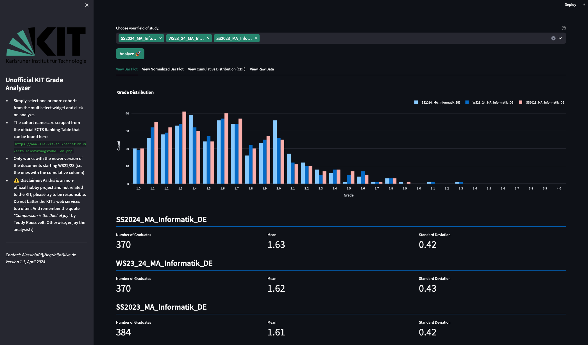

This tool is currently deployed on the streamlit community cloud and can be accessed via ...
```
https://kit-grade-analyzer.streamlit.app
```

# About the Project
Every semester the KIT officially releases the final grades of each field of study of a cohort, that usually comprises the last four semesters.
With this tool you can visualize, analyze and even compare the officially released documents, which can be found here:
[KIT ECTS Ranking Chart](https://www.sle.kit.edu/nachstudium/ects-einstufungstabellen.php).

# Example Preview


# Installation
Note that this project is already deployed on the streamlit community.
If you still want to install it locally, please follow the instructions below.
`Python Version 3.11.0` has been used for development.

1. Clone the repository by running the following command in your terminal:

   ```
   git clone https://github.com/negralessio/kit-grade-analyzer.git
   ```


2. Navigate to the project root directory by running the following command in your terminal:

   ```
   cd kit-grade-analyzer
   ```

3. Create a virtual environment and activate it.
   ```
   python3 -m venv venv
   source venv/bin/activate
   ```

4. Install the required packages by running the following command in your terminal:

   ```
   pip install -r requirements.txt
   ```

5. (Optional). Install pre-commit to help adhering to code styles and mitigating minor issues
   ```
   pre-commit install
   ```

# How To Run
1. Run GUI, while in root dir, via:

   ```
   streamlit run gui/app.py
   ```

2. Simply add one or more URL(s) into the corresponding text field.
